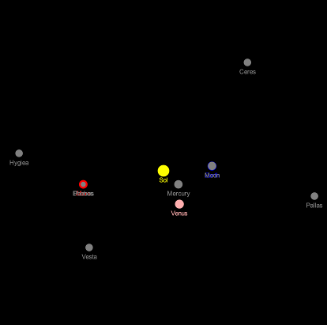
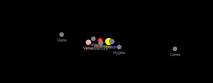

# Aufgabenblatt 7

## Allgemeine Anmerkungen
Ihre Lösung für dieses Aufgabenblatt ist bis Dienstag, 8.6., 12h durch `git commit` und `push` 
abzugeben.
Wenn Sie zusätzlich zu den gefragten Klassen und Interfaces weitere Klassen oder 
Interfaces definieren, achten Sie darauf, dass die Klassennamen mit `My` beginnen, um Konflikte 
mit späteren Aufgabenblättern zu vermeiden.

Im Verzeichnis `states` werden mehrere Dateien mit der Endung `.txt` mitgeliefert. Diese enthalten
Daten von je einem Himmelskörper sowie dessen Positionen und Geschwindigkeitsvektoren für alle 
Tage der Jahre 2019-2021. Die Angaben sind wie gewohnt in kartesischen Koordinaten, wobei die 
Sonne den Urspung des Koordinatensystems bildet und die Ekliptik die x-y-Ebene darstellt. 

ACHTUNG: Werte sind in km bzw. km/sec angegeben! 

Die Daten stammen von `https://ssd.jpl.nasa.gov/horizons.cgi#top`.

Weiters werden die Dateien `BodyCollection.java`, `StateFileNotFoundException.java`, 
`StateFileFormatException.java` und `ReadDataUtil.java` mitgeliefert. 

## Ziel
Ziel der Aufgabe ist das Verständnis und die Anwendung der Konzepte: Kopie vs. Sichtweise 
(Skriptum S. 106), Eingabe mit Validierung, Exceptions (S. 123).

## Gegebene Interfaces
Gegeben ist folgende Interface-Definition:
````
public interface BodyCollection extends BodyIterable {

    // Ensures that this collection contains the specified body. Returns 'true' if this collection
    // changed as a result of the call. (Returns false if this collection does not permit
    // duplicates and already contains the specified body.)
    boolean add(Body b);

    // Returns 'true' if this collection contains the specified body. More formally, returns
    // 'true' if and only if this collection contains at least one body 'c' such
    // that (b==null ? false : b.equals(c)).
    boolean contains(Body b);

    // Returns the number of bodies in this collection.
    int size();
    
    // Returns an array with all the bodies of this collection.
    Body[] toArray();

}
````

## Aufgaben

1. Ändern Sie Ihre Implementierung, sodass ein `BodyIterator` eine Exception 
    vom Typ `java.util.NoSuchElementException` wirft, falls `next()` aufgerufen wird,
    jedoch der Iterator keine weitere Iteration hat (`hasNext()` liefert `false`). Weiters 
    soll die Methode `remove()` überschrieben werden ([siehe API Dokumentation](https://docs.oracle.com/javase/8/docs/api/java/util/Iterator.html#remove--)), 
    sodass ein `BodyIterator` Einträge in seiner Collection löschen kann. Achten Sie darauf, dass
     hier in bestimmten Fällen eine `java.lang.IllegalStateException` geworfen werden soll.
    (Anmerkung: Dass das Entfernen von Himmelskörpern aus `ComplexCosmicSystem`-Objekten
    dazu führen kann, dass es Systeme mit weniger als zwei Himmelskörpern geben kann, lassen
    wir ausser Acht.)

2. Fügen Sie dem Interface `CosmicSystemIndex` folgende Methode hinzu
    ````
        // Returns a collection view of all `Body`-Objects listed in this
        // index (i.e. the set of keys). Subsequent changes in `this` will be
        // reflected in the returned collection view.
        BodyCollection getBodies();
    ````
    und implementieren Sie diese in den Klassen `CosmicSystemMap` und `ComplexCosmicSystem`. 
    Definieren Sie eine neue Klasse, deren Namen Sie selbst wählen können, die eine `BodyCollection` 
    Sichtweise auf die gespeicherten Schlüssel liefert. Analog zum Listing 3.39 im Skriptum auf 
    Seite 108 sollen die Klassen so implementiert sein, dass sich nachträgliche Änderungen in den 
    `CosmicSystemIndex`-Objekten auch im von `getBodies()` zurückgelieferten Objekt zeigen.
    Die Methode `add` von `BodyCollection` soll so implementiert 
    werden, dass diese immer `false` liefert, also die Sammlung unverändert lässt.

3. Validierung von Eingabedaten:
    - Implementieren Sie in der Klasse `ReadDataUtil.java` die Methode `readConfiguration`.
    Es soll ein gepufferter Stream zum Einlesen genutzt werden (siehe Skriptum Seite 128). 
    Erstellen Sie zum Testen auch Varianten der txt-Dateien mit Formatfehlern.
    - Fügen Sie der Klasse `Body` bei Bedarf 
    eine Methode `setState(Vector3 position, Vector3 velocity)` zum Setzen der Position 
    und des Geschwindigkeitsvektors des Himmelskörpers hinzu. 
    - Definieren Sie die beiden angegebenen Exceptionklassen in den entsprechenden 
    mitgelieferten Dateien. 
  
4. Ausnahmebehandlung:
    In der Klasse `Simulation` sollen nun die Himmelskörper mit Daten aus den gegebenen 
    txt-Dateien initialisiert werden. Dabei sollen zumindest die Sonne sowie die inneren Planeten
    Merkur, Venus, Erde und Mars vorkommen. Sie können weitere Himmelskörper (siehe txt-Dateien) 
    hinzufügen. Nutzen Sie die Klasse `ComplexCosmicSystem` und ihre Iteratoren, um die 
    Himmelskörper der Simulation zu verwalten.
    Ändern Sie die Klasse `Simulation` so, dass sie zwei Kommandozeilenargumente verarbeitet. 
    Das erste Argument ist ein String mit der Angabe des Pfades zum Verzeichnis, wo die 
    entsprechenden txt-Dateien (z.B. `Venus.txt`,`Mercury.txt`,`Earth.txt`) mit den Konfigurationen 
    der Himmelskörper zu finden sind. Die Dateien haben die Namen der Himmelskörper mit Endung `
    .txt`. Für die Sonne gibt es keine txt-Datei (es wird die Position (0,0,0) angenommen).
    Das zweite Argument ist ein String mit einer Datumsangabe der Form YYYY-MMM-DD, also z.B. 
    2020-Dec-04, die den Tag der auszulesenden Position und Bewegungsvektor bestimmt. Die Klasse 
    soll beim Auftreten von Problemen bei der Ausführung entsprechende Fehlermeldungen ausgeben und die 
    Ausführung in bestimmten Fällen beenden. Beispiele für Aufrufe im Kommandozeileninterpreter mit 
    entsprechenden Fehlermeldungen (Sie können zum Ausführen das Terminal in IntelliJ nutzen):
    ```
         $ javac Simulation.java
         $ java Simulation ../states 2021-May-28
         Running simulation ...
         $ java Simulation ../states
         Error: wrong number of arguments.
         $ java Simulation ../states 2025-Dec-12
         Error: State not available.
         $ java Simulation ../states-altered 2021-May-28
         Warning: File "Venus.txt" does not have required format. 
         Running simulation without Venus.
         Warning: File "Mars.txt" not found. 
         Running simulation without Mars.
         Running simulation ...
         $ java Simulation ../states -17
         Error: State not available.
         $ java Simulation blah -17
         Error: "blah" not found.
    ```
    
    Beispiele für die graphische Ausgabe:
   
    x-y-Ebene:
   
     
    
    y-z-Ebene (freiwillig):
    
    
    
5. Freiwillige Zusatzaufgabe (ohne Bewertung): 
    Ändern Sie die Klasse `Simulation` so, dass ein drittes optionales Kommandozeilenargument
    verarbeitet werden kann. Dieses gibt an, wieviele Tage simuliert werden sollen. Beispielsweise
    kann eine zweite Datumsangabe möglich sein, oder die Anzahl an Tagen. 
    Sobald dieser Zeitpunkt in der Simulation erreicht wurde, können die aktuellen Positionen der
    Himmelskörper mit den in den txt-Dateien angegebenen Positionen verglichen werden (z.B. 
    durch erneutem Aufruf von `readConfiguration` und `draw`). Wie groß sind die Abweichungen 
    der von NASA errechneten Positionen zu den Positionen, die Ihre Simulation liefert?

### Denkanstöße (ohne Bewertung)

1. Wie verhalten sich die von `toArray()` zurückgelieferten Array-Objekte, wenn deren 
enthaltene Himmelskörper durch `setState` verändert werden? Werden dadurch die Himmelskörper der 
ursprünglichen `CosmicSystemIndex`-Objekte auch geändert? (Anmerkung: diesbezüglich gibt es im 
diesem Aufgabenblatt keine Vorgaben).
2. Wie verhalten sich Ihre Iteratoren, wenn Objekte geändert werden?
3. Wie kann man durch Einfügen von Zeichen `,` und newlines (`\n`) aus den `txt`-Dateien eine 
"fehlerhafte" Datei machen, die trotzdem von der Methode akzeptiert wird? Kann man solche Probleme 
verhindern?
